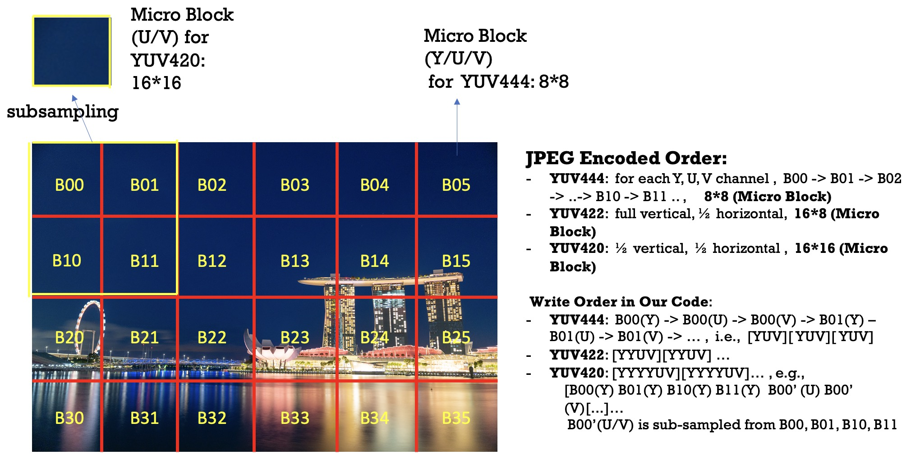

# Implement a JPEG Encoder (sequential mode) from scratch
This tutorial shows you how to implement a simple JPEG encoder (sequential mode) step by step. 


## What should you do?
Implement the following parts
- RGB to YUV color transform

- Sample image blocks, you are required to implement this method for **YUV 444**, **YUV 422**, and **YUV 420** 

For sub-sampling blocks, you can use `nearest` or `bilinear` interpolation (e.g., directly average a 2x2 area into a new pixel for YUV420).

- DCT (you are not allowed to use external library such as cv2.dct)

the time complexity of the original dct is O(n^4), and there are many optimized tricks can be found online. 

Once implemented the above functions, you can test the jpeg encoder with ``data/sg_0.png'' or other images.
You are encouraged to test images with different quality and yuv format settings.

## What will you achieve ?
- Learn the pipeline and details of a JPEG encoder
- Implement a simple JPEG encoder for fun, e.g., given a PNG image with size over **30MB**, 
with your JPEG encoder, it can be compressed to no more than **1MB**. 

## Remember clone this repo with recursive
```
git clone --recursive https://github.com/JosephChenHub/comp5425_assignment2_jpeg_encoder.git
```

## Preparation for CPP users 
We use ``cmake >= 3.13 " to build the project, actually you can use other compilers like Visual Studio, MingW, etc.
0. build 
```
cd ./jpeg_encoder && \
mkdir build && cd build \
cmake .. \
make -j
```
use **-DBUILD_TESTS=ON** to enable tests, **-DBUILD_PYTHON_MODULE=ON** to build python interface.

usage example:
```
./build/jpeg_encoder -i ./data/sg_0.png -o ./data/sg_0_q30_420.jpg -q 30 -f 420
```
This command will generate a JPEG image with quality 30 and YUV420 format. 

Some APIs of **Image** class:
```
Image<uint8_t> img1("./data/sg_0.png"); // load an image from file, only for uint8_t type
Image<uint8_t> img2 = img1; // copy 
img2(0, 5, 2) = 10;  // assign the pixel value to 10 at location(y=0, x=5, c=2) 
Image<float> img3;
img3.copyFrom(img2); // uint8_t -> float copy
```

**TASK** : For cpp users, you are required to complete functions in `src/JpegEncoder.cpp`

## Preparation for Python users
**Method 1 (via CMake)**

The python version is  based on cpp version (Huffman coding & JPEG IO), so you still need to 
build *jpeg_py* first:
0. add the pybind11 if you need a python wrapper 
```
cd ./jpeg_encoder && \
git submodule add https://github.com/pybind/pybind11.git
```
1. build the *jpeg_py* module:
```
cd ./jpeg_encoder && \
mkdir build && cd build \
cmake .. -DBUILD_PYTHON_MODULE=ON \
make -j
```
2. add *jpeg_py* to the Python environment :
```
import sys
sys.path.append("./build") # the path -> jpeg_py module, you should first build the module via cmake first 

from jpeg_py import YUVFormat, JpegIO, HuffmanCodec
```
Then you can use the following APIs:
- YUVFormat.YUV444 : YUV444 , i.e., no subsampling for luminance & chrominance
- YUVFormat.YUV420 : YUV420 ,  the Micro Block will look like [YYYYUV][YYYYUV]... [YYYYUV], 
                     i.e., subsampling chrominance from vertical (factor 2) & horizontal (factor 2) direction
- YUVFormat.YUV422 : YUV4222,  subsampling chrominance from horizontal direction (factor 2), [YYYYUUVV][YYYYUUVV]...[YYYYUUVV]
- JpegIO.writeToFile:  write the encoded image to disk
- HuffmanCodec : huffman coding for Y, U, V blocks

**Method 2(via setup.py)**:
```
python3 setup.py build 
```
then add the './build/xxx' to your python environment, or install the package via "python3 setup.py install"

**TASK** : For python users, you are required to complete functions in `python/jpeg_encoder.py`. 


## Reference materials:
- COMP5425, HK PolyU (lecturer: Prof. Changwen Chen)
- https://en.wikipedia.org/wiki/JPEG
- https://yasoob.me/posts/understanding-and-writing-jpeg-decoder-in-python/#discrete-cosine-transform-quantization
- Digital Video Concepts, Methods, and Metrics: Quality, Compression, Performance, and Power Trade-off Analysis
- https://users.ece.utexas.edu/~ryerraballi/MSB/pdfs/M4L1.pdf
- https://en.wikipedia.org/wiki/Chroma_subsampling#Sampling_systems_and_ratios
